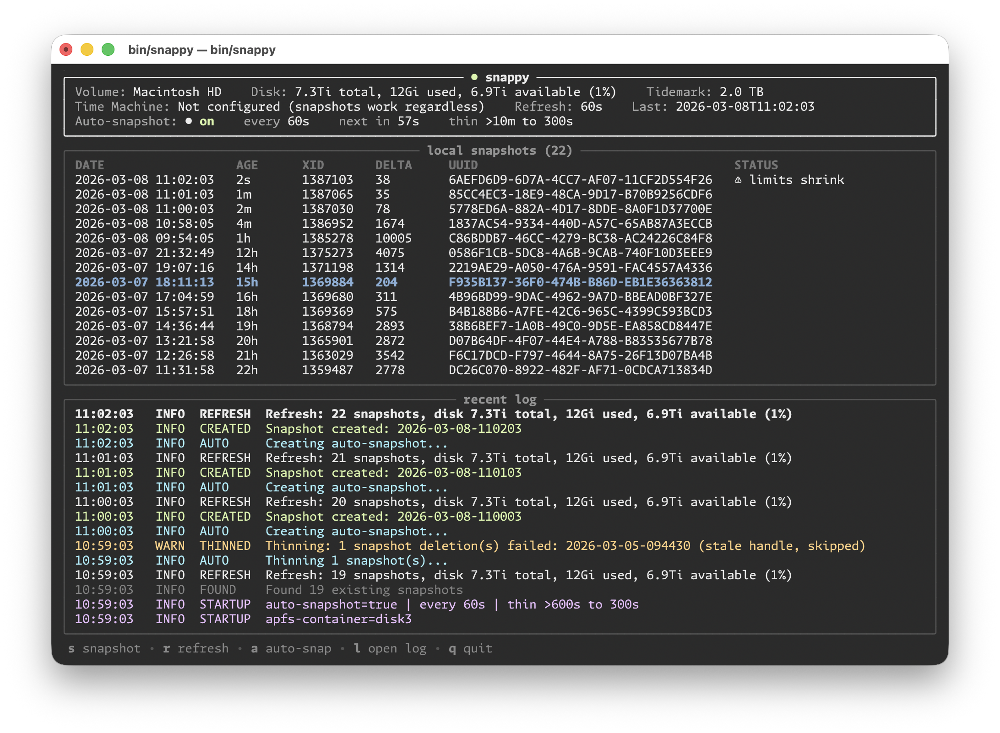

# Snappy

[](https://snappy.sh)

[](https://github.com/cboone/snappy/actions) [](https://goreportcard.com/report/github.com/cboone/snappy)  [](./LICENSE)

[**Quick Start**](#quick-start) ・ [**Why Use Snappy?**](#why-use-snappy) ・ [**Installation**](#installation) ・ [**Usage**](#commands-and-options) ・ [**Restoring Files and Snapshots**](#restoring-files-and-snapshots) ・ [**Limitations**](#limitations) ・ [**Full ToC**](#table-of-contents)

**Frequent, automatic, super fast, lightweight snapshot backups of your entire drive.** Snappy uses the macOS built-in snapshotting system to allow easy access to and rollbacks of individual files, directories, or the entire disk.

`brew install cboone/tap/snappy-tm` then `snappy service install` and it's installed and snapshotting. Run `snappy` on its own to see the status of your snapshots, view your config, and mount your snapshot backups to restore files.

**Snappy only runs on macOS.** It relies on [`tmutil`](https://man.freebsd.org/cgi/man.cgi?query=tmutil&manpath=macOS+26.3) and [APFS snapshots](https://eclecticlight.co/2026/01/31/explainer-snapshots-2/). If you're on Linux, [`zsh-auto-snapshot`](https://manpages.debian.org/trixie/zfs-auto-snapshot/zfs-auto-snapshot.8.en.html) is a good option (and is what inspired Snappy in the first place). AFAICT, it should work on pretty much any macOS version since 11 (macOS Big Sur), when [Time Machine](https://en.wikipedia.org/wiki/Time_Machine_%28macOS%29) began to use APFS snapshotting.

> [!TIP]
> **You don't need to use Time Machine for Snappy to work.** You can use [Time Machine's fancy UI](#using-time-machine-to-scrub-through-history) to view your backups and restore files if you want, or you can use [Snappy's snapshot mounting](#mounting-snapshots) to browse and restore your files via the Finder. None of the functionality requires Time Machine to be enabled, even using the Time Machine UI to view backups. You do get [a longer snapshot history](#configuring-time-machine) if you enable Time Machine local snapshots, but that's optional.
>
> You barely even need Snappy, for that matter. It provides easy setup, handy config options (with good defaults), a TUI to view and manage your snapshots, commands to mount your snapshots, and a few other niceties. But at its core, Snappy's a glorified Bash script cron job. So much so that I've included a super simple Bash script you could use instead, if you want frequent snapshots without installing a binary and are happy using `tmutil`, `diskutil`, and `asr` to manage the rest: [`snappy-ez`](./bin/snappy-ez). More details on [how to use it](#snappy-ez) below.

**AI usage:** Snappy is a 3 out of 5 on [my personal vibes scale](#vibes), meaning that the code and tests were written by LLMs micro-managed by me. Robot code; human architecture, design (in all senses), code review, and manual testing. I wrote this README; other docs are a mix. Read more about my use of LLMs and my workflow in [my AI transparency statement](#ai-transparency). Also see my note about [LLMs and copyright and licensing](#license).

## Why Use Snappy?

To add to your local hard drive's safety net. By default, Snappy tells macOS to take a complete snapshot of your drive every minute, then thins those snapshots down to 5 minute increments after 10 minutes. Then macOS thins backups older than 1 hour to hourly, then reduces the frequency to daily after 1 day, and weekly after 1 week.[<sup>✻</sup>](#how-time-machine-works)

```text
now            -10 min          -1 hour          -1 day           -1 week
 ├────────────────┼────────────────┼────────────────┼╌╌╌╌╌╌╌╌╌╌╌╌╌╌╌╌┼╌╌╌╌╌╌╶╶╶
 │||||||||||||||||│ |  |  |  |  |  |   |   |    |   │        |       │
 │  every minute  │  every 5 min   │     hourly     │      daily     │  weekly
 ╰──────────── Snappy ─────────────┴────  macOS ────┴╌╌╌╌╌╌╌╌╌ Time Machine ╶╶╶
```

These snapshots are complete clones of your hard drive, stored exactly as it was at the moment the snapshot was taken. Because of the copy-on-write cloning technique they use, minimal storage is needed for each one. Megabytes or gigabytes per clone on a many-terabyte file system, typically. This is what allows you to save so many copies of everything on your drive.

Hopefully you'll install Snappy and let it run and rarely think about it. But if something goes wrong, like an LLM agent deleting what it shouldn't, a ransomware attack encrypting your sensitive data, an installation gone bad, or just a simple mistake, you can easily restore your files, your directories, or even your entire drive.

See below for more on [How Snappy Works](#how-snappy-works), [How to Configure Snapshot Frequency](#configuration), and [How to Restore Files and Snapshots](#restoring-files-and-snapshots).

### Why Not Just Use Time Machine?

You should [use Time Machine](https://support.apple.com/en-us/104984), it's great. You should use Time Machine both for its ability to create incremental backups on an external drive (its documented and marketed use) and for its ability to create local APFS snapshots. But the most often Time Machine will create local snapshots is once every hour. Snappy increases that frequency dramatically (and allows you to customize it).

Is once every hour good enough for you? Then just use Time Machine, it's simple and works great. Want more? Use Snappy, it's also simple and automatic and is completely integrated into Time Machine's existing capabilities.

## Quick Start

Install Snappy via [Homebrew](https://brew.sh):

```sh
brew install cboone/tap/snappy-tm
```

Then start the background service so snapshots are taken automatically:

```sh
snappy service install
```

That installs the `snappy` command, along with shell completions and a man page, and sets up Snappy to run every minute. Until something goes wrong, that's really all you need to do.

To open Snappy's TUI, just run `snappy`. You'll see what snapshots have been taken and information about them, logs of all Snappy's and macOS's snapshot management activities. You can delete or thin snapshots to clear up space. Most importantly, you can mount snapshots as read-only local drives to browse and restore files.

All of this can be done non-interactively as well via various [commands and options](#commands-and-options). Read more below, or run `snappy help` or `man snappy`. Also, see below for more on [How Snappy Works](#how-snappy-works), [How to Configure Snapshot Frequency](#configuration), and [How to Restore Files and Snapshots](#restoring-files-and-snapshots).

## Table of Contents

[**Introduction**](#snappy) ・ [**Why Use Snappy?**](#why-use-snappy) ・ [**Why Not Just Use Time Machine?**](#why-not-just-use-time-machine) ・ [**Quick Start**](#quick-start)<br>
[**Restoring Files and Snapshots**](#restoring-files-and-snapshots) ・ [**Using Time Machine to Scrub Through History**](#using-time-machine-to-scrub-through-history) ・ [**Mounting Snapshots**](#mounting-snapshots) ・ [**Opening Previous File Revisions Within Apps**](#opening-previous-file-revisions-within-apps) ・ [**Restoring Your Entire Drive**](#restoring-your-entire-drive)<br>
[**Installation**](#installation) ・ [**Homebrew**](#homebrew-recommended) ・ [**Shell Script**](#shell-script) ・ [**GH Release**](#gh-release) ・ [**Shell Completions**](#shell-completions)<br>
[**Commands and Options**](#commands-and-options) ・ [**Interactive TUI**](#interactive-tui) ・ [**Background Service**](#background-service)<br>
[**Configuration**](#configuration) ・ [**Generate a Config File**](#generate-a-config-file) ・ [**View Configuration**](#view-configuration) ・ [**Configuration Settings**](#configuration-settings) ・ [**Configuring Time Machine**](#configuring-time-machine)<br>
[**How Snappy Works**](#how-snappy-works) ・ [**How Time Machine Works**](#how-time-machine-works)<br>
[**snappy-ez**](#snappy-ez) ・ [**Download**](#download) ・ [**Run in the Foreground**](#run-in-the-foreground) ・ [**Run in the Background**](#run-in-the-background) ・ [**Customize**](#customize)<br>
[**Background**](#background)<br>
[**Limitations**](#limitations) ・ [**Comparison**](#comparison) ・ [**Open Questions**](#open-questions) ・ [**To Document**](#to-document)<br>
[**Vibes**](#vibes) ・ [**AI Transparency**](#ai-transparency) ・ [**License**](#license)

## Restoring Files and Snapshots

Using the Time Machine local snapshots gives you choices on how to undo errors and restore data. Again, none of these options requires that you [turn on Time Machine backups](#configuring-time-machine), though that does give you a longer snapshot history.

TODO: Create screen recordings.

### Using Time Machine to Scrub Through History

This is the fastest way to restore small numbers of files or directories.

Open the directory you want to restore in the Finder, then open [the Time Machine app](https://support.apple.com/guide/mac-help/restore-files-mh11422/mac). (Via Spotlight is probably the easiest way.) Time Machine's fancy history browser will take over and you can move forward and back through the history of your file system. Select as much or as little as you'd like to restore (from one file to a whole disk) and click the `Restore` button.

You can't open the files from within Time Machine, but you can use Quick Look on them to preview the contents. Double click, press space bar, or right click and choose `Quick Look`.

### Mounting Snapshots

TODO: Finalize in-Snappy commands and document.

You can also use Disk Utility<sup>✻</sup> to view and manage snapshots. Select `Show APFS Snapshots` from the `View` menu to see the current list. Double click a snapshot and it will mount and open in the Finder. You can also rename and delete snapshots this way. Read more at [the Eclectic Light Company blog](https://eclecticlight.co/2021/11/09/disk-utility-now-has-full-features-for-managing-snapshots/).

✻ `/Applications/Utilities/Disk Utility.app`

TODO: Document using `diskutil`.

### Opening Previous File Revisions Within Apps

If you just need to restore an earlier version of a single file and that file is open in a native macOS app, then [the fastest way to roll it back](https://support.apple.com/guide/mac-help/view-and-restore-past-versions-of-documents-mh40710/26/mac/26) is to select `Revert To > Browse All Versions` from the `File` menu. You'll find yourself in a version of the Time Machine history scrubber, but just for that file. Click `Restore` to get that version back, or press `option`and click `Restore a Copy`to open that version in a new file.

### Restoring Your Entire Drive

TODO: Document GUI and `asr` procedures.

## Installation

### Homebrew (Recommended)

The simplest method is via [Homebrew](https://brew.sh):

```sh
brew install cboone/tap/snappy-tm
snappy service install
```

That installs the `snappy` command, along with shell completions and a man page, and installs the background service so that Snappy runs every minute.

### Shell Script

```sh
curl -fsSL https://raw.githubusercontent.com/cboone/snappy/main/install.sh | bash
```

To install a specific version:

```sh
curl -fsSL https://raw.githubusercontent.com/cboone/snappy/main/install.sh | bash -s -- --version v1.0.0
```

### GH Release

TODO: Document.

```sh
gh release ...
```

### Shell Completions

Homebrew and `install.sh` install shell completions automatically. If you need to set them up manually, use the `snappy completion` command:

#### Bash

```bash
snappy completion bash > "$(brew --prefix)/etc/bash_completion.d/snappy"
```

#### Zsh

```bash
snappy completion zsh > "$(brew --prefix)/share/zsh/site-functions/_snappy"
```

If you're not using Homebrew, place the file in any directory in your `fpath`:

```bash
snappy completion zsh > ~/.zsh/completions/_snappy
```

Then ensure the directory is in your `fpath` and `compinit` is loaded in `~/.zshrc`:

```bash
fpath=(~/.zsh/completions ${fpath})
autoload -Uz compinit && compinit
```

#### Fish

```bash
snappy completion fish > ~/.config/fish/completions/snappy.fish
```

Open a new shell session after installation to activate completions.

## Commands and Options

Run `snappy help` or `snappy help <command>` for detailed usage. Or read the man page: `man snappy`.

| Command              | Description                                    |
| -------------------- | ---------------------------------------------- |
| `snappy`             | Launch the interactive TUI                     |
| `snappy completion`  | Generate shell completions (bash/zsh/fish)     |
| `snappy config`      | Show active configuration                      |
| `snappy config init` | Create a default config file                   |
| `snappy create`      | Create a new local Time Machine snapshot       |
| `snappy list`        | List snapshots with details                    |
| `snappy run`         | Run the auto-snapshot loop in the foreground   |
| `snappy service ...` | Manage the background service                  |
| `snappy status`      | Show Time Machine and disk status              |
| `snappy thin`        | Thin old snapshots based on configured cadence |
| `snappy version`     | Print the version number                       |
| `snappy help`        | Show help for any command                      |

| Flag              | Description                                           |
| ----------------- | ----------------------------------------------------- |
| `--config <path>` | Config file (default: `~/.config/snappy/config.yaml`) |
| `-h`, `--help`    | Show help for the current command                     |
| `-v`, `--version` | Print the version number                              |

### Interactive TUI

Running `snappy` with no command launches the interactive TUI:



### Background Service

Snappy can run as a macOS LaunchAgent, taking snapshots and thinning old ones automatically in the background. The service starts at login and restarts if it exits unexpectedly.

#### Install the Background Service

```sh
snappy service install
```

This generates a launchd plist, loads it, and starts the service immediately. You only need to run this once.

#### Manage the Background Service

| Command                    | Description                             |
| -------------------------- | --------------------------------------- |
| `snappy service`           | Show service status (default)           |
| `snappy service status`    | Show service status                     |
| `snappy service install`   | Install the plist and start the service |
| `snappy service uninstall` | Stop the service and remove the plist   |
| `snappy service start`     | Start a stopped service                 |
| `snappy service stop`      | Stop the running service                |
| `snappy service log`       | Tail the service log (`Ctrl-C` to exit) |

#### TUI and Service Coexistence

Only one auto-snapshot routine runs at a time. When the background service is active, the TUI detects it and disables its own auto-snapshot loop. The TUI header shows "service" next to the auto-snapshot indicator so you know the background service is handling it. You can still use the TUI to create manual snapshots, browse snapshot history, mount snapshots, and manage thinning.

## Configuration

Snappy reads configuration from `~/.config/snappy/config.yaml` or environment
variables prefixed with `SNAPPY_`. Pass `--config <path>` to use a custom file.

### Generate a Config File

Create a default config file with all settings and comments:

```sh
snappy config init
```

This writes to `~/.config/snappy/config.yaml` (or the path given by
`--config`). The command will not overwrite an existing file.

### View Configuration

Show the active configuration, including values from the config file,
environment variables, and defaults:

```sh
snappy config
```

### Configuration Settings

| Setting                  | Env var                         | Default   | Description                        |
| ------------------------ | ------------------------------- | --------- | ---------------------------------- |
| `auto_enabled`           | `SNAPPY_AUTO_ENABLED`           | `true`    | Enable auto-snapshots at startup   |
| `auto_snapshot_interval` | `SNAPPY_AUTO_SNAPSHOT_INTERVAL` | `60s`     | Interval between auto-snapshots    |
| `log_dir`                | `SNAPPY_LOG_DIR`                | (auto)    | Log directory path                 |
| `log_max_files`          | `SNAPPY_LOG_MAX_FILES`          | `3`       | Number of rotated backup files     |
| `log_max_size`           | `SNAPPY_LOG_MAX_SIZE`           | `5242880` | Max log file size in bytes (5 MB)  |
| `refresh`                | `SNAPPY_REFRESH`                | `60s`     | How often to refresh snapshot list |
| `thin_age_threshold`     | `SNAPPY_THIN_AGE_THRESHOLD`     | `600s`    | Age before snapshots are thinned   |
| `thin_cadence`           | `SNAPPY_THIN_CADENCE`           | `300s`    | Minimum gap kept when thinning     |

### Configuring Time Machine

TODO: Write.

## How Snappy Works

TODO: Write.

### How Time Machine Works

```text
now            -1 hour          -1 day           -1 week
 ├────────────────┼────────────────┼────────────────┼────╶╶╶╶╶╶
 │                |   |   |    |   │        |       │
 │                │     hourly     │      daily     │  weekly
 ╰────────────────┴────────── Time Machine ─────────┴────╶╶╶╶╶╶
```

## snappy-ez

A standalone bash script that provides snappy's core functionality (create
snapshots, thin old ones, log state) without the TUI, Go, or a build step.
Download it, edit the constants, and run.

### Download

```sh
curl -fsSL https://raw.githubusercontent.com/cboone/snappy/main/bin/snappy-ez -o snappy-ez
chmod +x snappy-ez
```

### Run in the Foreground

```sh
./snappy-ez
```

Press `Ctrl-C` to stop.

### Run in the Background

```sh
./snappy-ez >> ~/snappy-ez.log 2>&1 &
tail -f ~/snappy-ez.log    # monitor
kill %1                     # stop
```

### Customize

Edit the constants at the top of the script:

| Constant             | Default | Description                                   |
| -------------------- | ------- | --------------------------------------------- |
| `SNAPSHOT_INTERVAL`  | `60`    | Seconds between snapshots                     |
| `THIN_AGE_THRESHOLD` | `600`   | Snapshots younger than this are never thinned |
| `THIN_CADENCE`       | `300`   | Minimum gap between kept old snapshots        |

## Background

I began building it to replicate the functionality of [`zsh-auto-snapshot`](https://manpages.debian.org/trixie/zfs-auto-snapshot/zfs-auto-snapshot.8.en.html), which allows Linux users (who are using [the zfs filesystem](https://en.wikipedia.org/wiki/ZFS)) to...

TODO: Write.

## Limitations

TODO: Write.

## Comparison

There are other good tools that provide similar functionality.

TODO: Write.

## Open Questions

Details I haven't yet resolved with my own experimentation and haven't found definitive answers for on the web:

- [ ] How does TM manage local snapshots when the remote backup disk isn't connected?
  - [ ] Does it keep taking hourly snapshots?
  - [ ] How does it manage thinning?
- [ ] Is a new snapshot taken every time you manually trigger a TM backup?
- [ ] Can non-system drives be handled in the same way?
- [ ] Can snapshots be transferred, à la zfs?
- [ ] Do the TM backup exclusions apply to local snapshots?
- [ ] It appears that without TM local backups enabled, macOS prevents snapshots from being kept longer than 24 hours. Is this still true with TM local backups only enabled? With remote backups only enabled?
- [ ] How long does TM keep the weekly snapshots?

## To Document

- [ ] Using `asr`, `diskutil`, `tmutil`

## Vibes

TODO: Write.

## AI Transparency

TODO: Write.

## License

[MIT License](./LICENSE). TL;DR: Do whatever you want with this software, just keep the copyright notice included. The authors aren't liable if something goes wrong.
